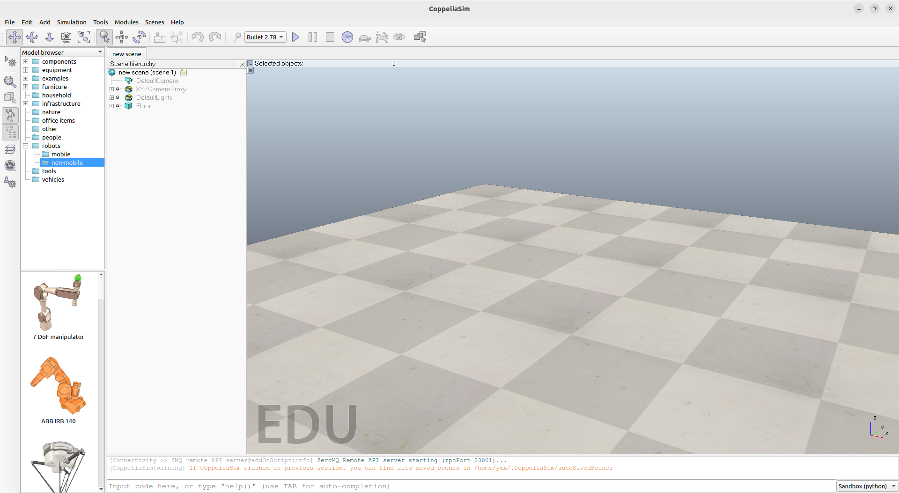
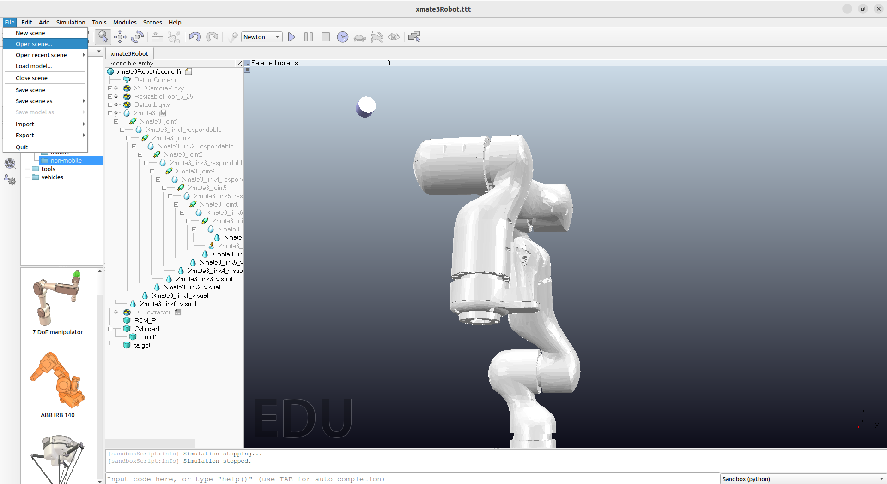
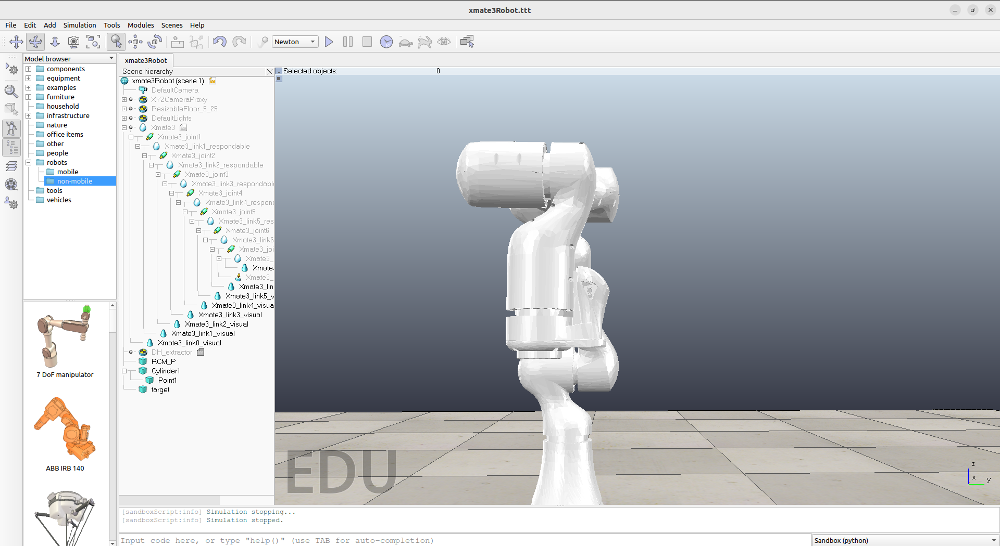

### 下载
访问[官网](https://www.coppeliarobotics.com/#download)下载。
下载解压进入目录，在终端打开，运行`./coppeliaSim`即可打开新界面，类似于

然后可以打开模拟场景（仓库里自带一个[here](../copwrap/xmate3Robot.ttt)）。

点击左上角file，选择open scene，再按路径导入即可看见机器臂（或者直接运行[test](../test.py)脚本，会自动导入）：

可以用GUI玩玩，左上角的工具栏有几个选项，第一个是左右平移，第二个是定点旋转，第三个是拉近拉远。
